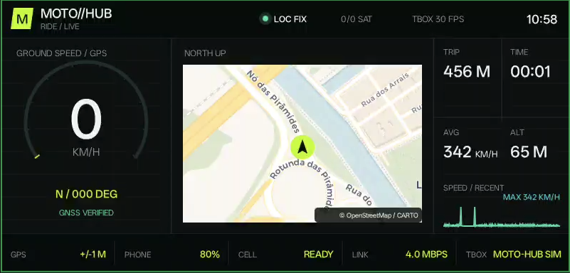
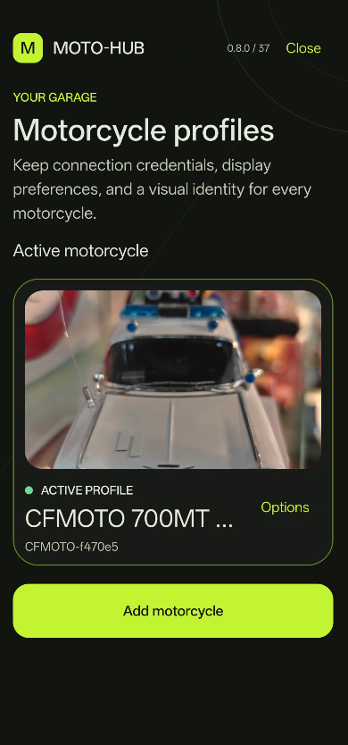
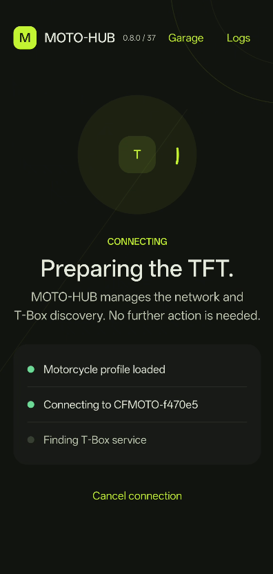

# MOTO-HUB

> [!WARNING]
> **MOTO-HUB is an experimental proof-of-concept, not a production-grade product.** It has been built and tested with a CFMOTO **700MT-ADV** dashboard and **OnePlus 13 / Galaxy Z Fold4** phones. Behavior may be unstable, require a retry, or differ on other motorcycles, T-Box firmware versions, or phones. Do not depend on it as your only source of critical navigation information. Plan your route before riding, and use the software at your own risk.
>
> <table cellpadding="0" cellspacing="0" border="0">
  <tr>
    <td></td>
    <td></td>
    <td></td>
  </tr>
</table>

MOTO-HUB is an Android 14+ application for connecting a phone to a compatible motorcycle T-Box and projecting content to the motorcycle TFT display.

The app supports Android Auto, whole-screen mirroring, and Android's app-specific screen sharing flow. It is designed as a personal, local-first project and is not affiliated with or endorsed by CFMOTO, EasyConn, MotoPlay, Google, or any other vehicle or software vendor.

## What It Does

- Pair with a motorcycle T-Box by scanning its QR code.
- Store multiple motorcycle profiles and select the active motorcycle.
- Store a private motorcycle photo and use it throughout the app UI.
- Connect to the T-Box Wi-Fi access point without requiring manual SSID entry.
- Discover the EasyConn service and establish the T-Box session.
- Mirror the entire phone screen or a single Android app.
- Start Android Auto through an embedded local head-unit receiver.
- Choose the Android Auto TFT layout per motorcycle:
  - `FIT`: preserve the complete image and use black bars when necessary.
  - `FILL`: use the full TFT canvas with slight stretching.
- Keep the phone preview available for Android Auto touch control.
- Show persistent diagnostics and export application logs for troubleshooting.

## Current Status

The current Android client is version `0.8.0` and targets Android 14/API 34 and newer.

The application has been tested end-to-end on a OnePlus 13 and a CFMOTO motorcycle T-Box. Compatibility with other phones, motorcycle models, T-Box firmware versions, and Android Auto versions is not guaranteed and must be validated separately.

This is still an experimental project. Do not rely on it as the only navigation or safety system, and configure navigation while stationary.

## Repository Layout

```text
MOTO-HUB/
├── apps/android/       Android application and projection pipelines
├── packages/contracts/ Future platform-neutral contracts
├── tooling/            AAR build metadata and reproducibility helpers
├── documentation/      Architecture, decisions, security, testing, and roadmap
└── README.md           Project overview and setup instructions
```

The public repository contains only the MOTO-HUB source, documentation, build metadata, and non-sensitive required artifacts. External projects are referenced by their public URLs below and are not vendored into this repository.

## Build Requirements

- Android Studio with its bundled JDK 17.
- Android SDK platform/API 36.
- A physical Android device. An emulator cannot reproduce the motorcycle Wi-Fi, camera, NSD, or Android Auto behavior.
- A generated `hudlib.aar` from the MOTO-HUB ridedaemon fork.

From `apps/android/`:

```bash
export JAVA_HOME="/Applications/Android Studio.app/Contents/jbr/Contents/Home"
export ANDROID_HOME="$HOME/Library/Android/sdk"

./gradlew lintDebug testDebugUnitTest assembleDebug
```

The generated Android binding is expected at:

```text
apps/android/app/libs/hudlib.aar
```

To rebuild it, install Go and `gomobile`, then run these commands from the directory that contains the `MOTO-HUB` folder:

```bash
git clone https://github.com/vincenzobpt/ridedaemon-lib ridedaemon-lib
cd ridedaemon-lib
gomobile bind -target=android -androidapi 34 -o ../MOTO-HUB/apps/android/app/libs/hudlib.aar ./hud/api
```

The source commit and AAR checksum must be updated in [`tooling/ridedaemon.lock`](tooling/ridedaemon.lock) whenever the artifact changes.

### Android Auto identity files

The public source intentionally does **not** include the static Android Auto head-unit identity (`aa_cert` and `aa_identity_data`). Those files are private build inputs copied from `tooling/private/android-auto/` only when the explicit Gradle property below is enabled. They must never be committed or uploaded to a public repository.

Without those files, the public build remains usable for pairing, T-Box streaming, mirroring, and diagnostics, but Android Auto reports that its private identity is unavailable. This separation is intentional.

For a private sideload build that keeps Android Auto enabled, place the two identity files in `tooling/private/android-auto/` and run:

```bash
./gradlew -PincludeAndroidAutoIdentity=true exportPrivateAndroidAutoApk
```

The generated APK is copied to `artifacts/MOTO-HUB-0.8.0-37-android-auto-private.apk`. It contains the private identity and is intended only for private sideloading. It must not be attached to a public GitHub release.

For the first public preview APK, use the default build without the identity:

```bash
./gradlew exportPublicApk
```

This produces `artifacts/MOTO-HUB-0.8.0-37-public.apk`. It is installable for public testing, but Android Auto remains unavailable by design.

## Android Features

### Motorcycle Garage

The garage stores multiple motorcycle profiles. Each profile can contain:

- T-Box SSID and encrypted Wi-Fi password.
- QR-provided metadata when available.
- A user-defined display name.
- A private motorcycle photo.
- Android Auto display format.

Existing single-profile data is migrated automatically when the app is upgraded.

### Projection Modes

`Mirroring` uses Android `MediaProjection` and supports either the complete phone display or an app selected through Android's system picker.

`Android Auto` runs through a local Android Auto Projection receiver. The decoded Android Auto video is composited, encoded as H.264, and sent to the T-Box through the ridedaemon transport.

### Network Behavior

The T-Box Wi-Fi network is a local display transport and may not provide Internet access. MOTO-HUB requests the T-Box network explicitly and keeps the T-Box transport separate from normal phone connectivity where Android allows it. OEM network behavior can vary, especially on OnePlus devices.

## Documentation

- [Architecture](documentation/ARCHITECTURE.md)
- [Android implementation](documentation/ANDROID_IMPLEMENTATION.md)
- [Reference analysis](documentation/REFERENCE_ANALYSIS.md)
- [T-Box streaming contract](documentation/TBOX_STREAMING_CONTRACT.md)
- [Security, privacy, and licensing](documentation/SECURITY_AND_PRIVACY.md)
- [Test strategy](documentation/TEST_STRATEGY.md)
- [Roadmap](documentation/ROADMAP.md)
- [Risk register](documentation/RISK_REGISTER.md)
- [Architecture decisions](documentation/decisions/README.md)

## Technical Sources And Attribution

MOTO-HUB was developed using the following public projects as technical sources. The links below are references and attribution; they are not claims of endorsement.

### Ridedaemon library fork

- [vincenzobpt/ridedaemon-lib](https://github.com/vincenzobpt/ridedaemon-lib) - the fork used to generate the Android `hudlib.aar` binding.
- [charliecharlieO-o/ridedaemon-lib](https://github.com/charliecharlieO-o/ridedaemon-lib) - upstream project and protocol implementation.

The library implements EasyConn discovery, the T-Box handshake, control channels, media polling, H.264 framing, and the `gomobile` Android API.

### Reference Android integration

- [charliecharlieO-o/ridedaemon-android](https://github.com/charliecharlieO-o/ridedaemon-android) - reference Android integration used to study QR parsing, Wi-Fi provisioning, NSD discovery, MediaCodec configuration, and frame delivery.

### Android Auto and CFMOTO research

- [BojanJ/open-cfmoto](https://github.com/BojanJ/open-cfmoto) - independent Android Auto and CFMOTO T-Box research used to understand the local Android Auto receiver flow, self-mode startup, touch input, and video pipeline behavior.

### Vendor and platform references

- [EasyConn](https://www.easyconn.net/) - vendor context for the T-Box ecosystem.
- [Android MediaProjection](https://developer.android.com/media/grow/media-projection) - Android screen capture API.
- [Android MediaCodec](https://developer.android.com/reference/android/media/MediaCodec) - hardware video encoding and decoding API.
- [Android Wi-Fi network requests](https://developer.android.com/develop/connectivity/wifi/wifi-suggest) - Android Wi-Fi provisioning APIs.

## Licensing And Publication Gate

This section is intentionally explicit because the project combines original MOTO-HUB code with external components and research.

- `ridedaemon-lib` and the reference Android project are distributed under GPL-3.0 according to their repositories and license files.
- The generated `hudlib.aar` is derived from the GPL-3.0-only ridedaemon fork. A public distribution containing it must include the corresponding source and comply with the applicable GPL obligations.
- The `open-cfmoto` project used for research does not contain a license file in the reviewed source snapshot. No code from that project should be published as part of MOTO-HUB until its redistribution terms and attribution requirements are verified.
- The final MOTO-HUB license and repository notices must be selected before the first public push.
- CFMOTO, EasyConn, MotoPlay, Android Auto, Google, and related names remain the property of their respective owners. MOTO-HUB is an independent project and must not imply official support.

This README is a publication draft, not a legal opinion. The final repository should include the exact license texts and notices required by every distributed component.

## Privacy Notes

MOTO-HUB is designed to operate locally and does not require an account or remote telemetry. It handles screen content, T-Box credentials, and diagnostic data on the phone. Wi-Fi passwords are encrypted with Android Keystore. Screen frames are processed in memory for the active projection and are not intentionally recorded to disk.

Review [Security and Privacy](documentation/SECURITY_AND_PRIVACY.md) before distributing an APK outside personal use.

The first public source release does not include the Android Auto private identity. A public APK built from that source can be downloaded and used for mirroring, but Android Auto requires a separate private build.

## Disclaimer

Use MOTO-HUB only while parked during setup and testing. The project is provided for experimentation with personally owned hardware and without any safety guarantee or vendor support.
