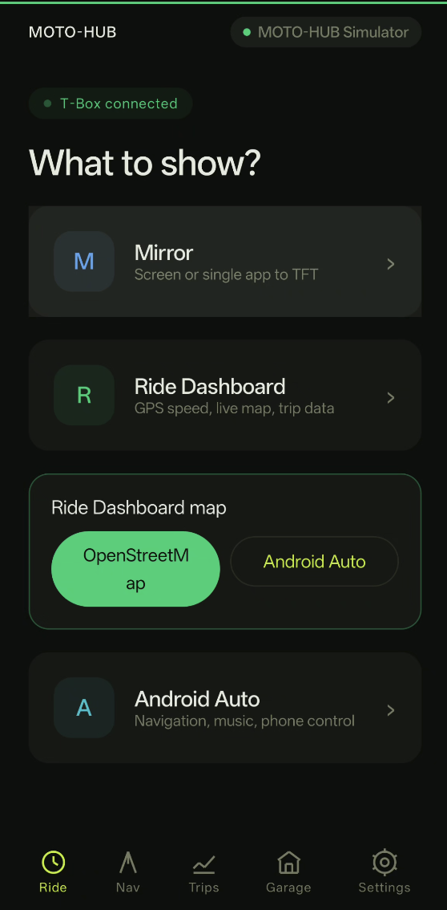
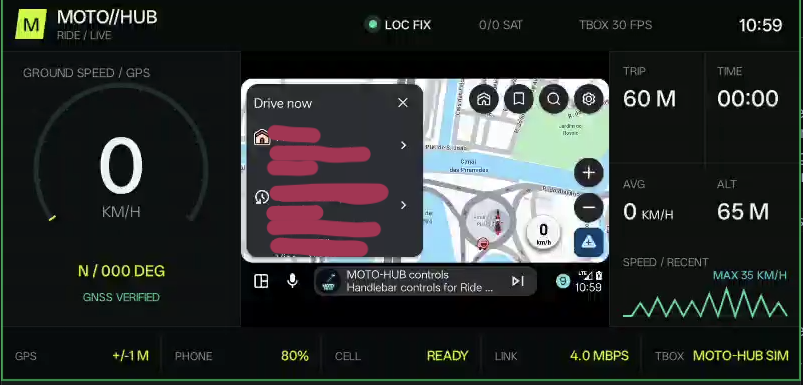
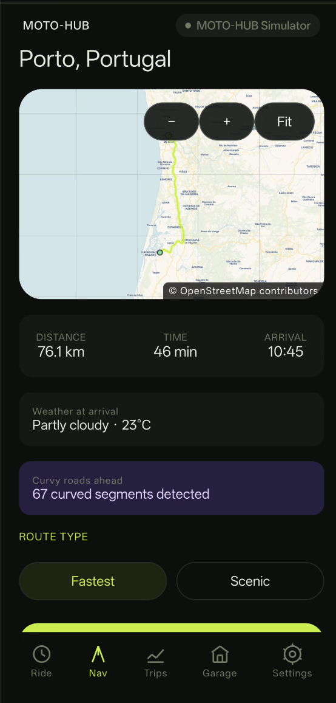
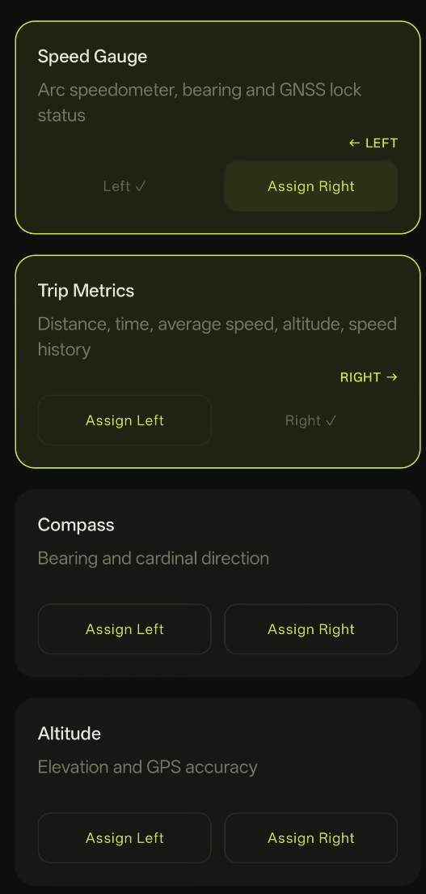
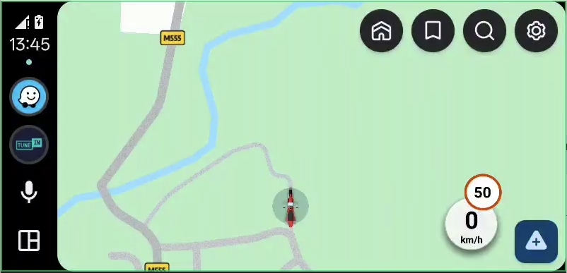

# MOTO-HUB

> [!IMPORTANT]
> [**JOIN US ON DISCORD TO RECEIVE SUPPORT, HELP THE COMMUNITY AND FOLLOW THE APP DEVELOPMENT**](https://discord.gg/uCUK55nJ5v)

> [!WARNING]
> **MOTO-HUB is an experimental proof-of-concept, not a production-grade product.** It has been built and tested with a CFMOTO **700MT-ADV** dashboard and **OnePlus 13 / Galaxy Z Fold4** phones. Behavior may be unstable, require a retry, or differ on other motorcycles, T-Box firmware versions, or phones. Do not depend on it as your only source of critical navigation information. Plan your route before riding, and use the software at your own risk.

<table cellpadding="0" cellspacing="0" border="0">
  <tr>
    <td align="center" width="25%">
      <br>
      <sub>Home &mdash; choose what to project</sub>
    </td>
    <td align="center" width="25%">
      <br>
      <sub>Ride Dashboard &mdash; speed, map, trip</sub>
    </td>
    <td align="center" width="25%">
      <br>
      <sub>Ride Dashboard &mdash; weather &amp; phone status</sub>
    </td>
    <td align="center" width="25%">
      <br>
      <sub>Ride Dashboard &mdash; embedded Android Auto</sub>
    </td>
  </tr>
  <tr>
    <td align="center" width="25%">
      <br>
      <sub>Navigation &mdash; route preview</sub>
    </td>
    <td align="center" width="25%">
      <br>
      <sub>Customize Dashboard &mdash; per-panel widgets</sub>
    </td>
    <td align="center" width="25%">
      <br>
      <sub>Full Android Auto on the TFT</sub>
    </td>
    <td align="center" width="25%">
      <br>
      <sub>Phone-side preview &mdash; no T-Box needed</sub>
    </td>
  </tr>
</table>

MOTO-HUB is an Android 14+ application for connecting a phone to a compatible motorcycle T-Box and projecting content to the motorcycle TFT display.

The app supports Android Auto, whole-screen mirroring, Android's app-specific screen sharing flow, a native Ride Dashboard, turn-by-turn Navigation, trip recording, and local diagnostics. It is designed as a personal, local-first project and is not affiliated with or endorsed by CFMOTO, EasyConn, MotoPlay, Google, or any other vehicle or software vendor.

## Download The Latest APK

For the latest manually published Android package, visit the [latest MOTO-HUB release](https://github.com/vincenzobpt/MOTO-HUB/releases/latest).

On the release page, expand **Assets** and download the file ending in `.apk`. Do not download **Source code (zip)** or **Source code (tar.gz)**: those files contain the project source, not an installable application. Android may ask you to allow installation from this source the first time; this is a normal Android security prompt for APKs installed outside Google Play.

## Permissions And Privacy

MOTO-HUB is a local-first app. The permissions below are used to connect to the motorcycle, scan its pairing QR code, keep an active projection running, provide user controls, and record GPS tracks only when trip recording is active. The app does not require an account and does not upload screen content or recorded trips.

### Permissions requested while using the app

| Permission | When it is requested | Why it is needed | What it does not mean |
| --- | --- | --- | --- |
| **Camera** | When you choose live QR scanning | Reads the T-Box QR code shown on the motorcycle TFT | The camera is not needed for normal streaming, and camera frames are not intentionally recorded or uploaded |
| **Nearby devices / Wi-Fi** | When you connect to a saved or newly paired motorcycle | Finds and requests the motorcycle's Wi-Fi access point, then communicates with the local T-Box | It is not Bluetooth tracking and does not grant access to unrelated nearby devices |
| **Location** | Requested while connecting to the T-Box or starting a manual trip | Supports Android Wi-Fi discovery, Ride Dashboard GNSS data, Navigation, and local trip recording | MOTO-HUB does not upload ride history; when a map is visible or a route is being searched/calculated, its approximate area is necessarily disclosed to the relevant mapping, geocoding, or routing service (see [Privacy Notes](#privacy-notes)) |
| **Notifications** | When starting projection or trip recording on Android 13 and newer | Shows the required foreground-service status and gives you visible controls to stop or manage an active session | It is not remote telemetry; notifications stay on the phone |

### System confirmations and optional access

| Access | When it is used | Why it is needed |
| --- | --- | --- |
| **Screen sharing confirmation** | Every time you start phone mirroring or app-specific sharing | Android requires the user to approve capture of the whole display or a selected app. MOTO-HUB cannot approve this silently |
| **Display over other apps** *(optional)* | Only if you enable phone-display dimming during projection | Places a non-touchable overlay over the phone display to reduce brightness while the TFT continues receiving the projection. The overlay can be removed from MOTO-HUB or by stopping the session |

### Technical permissions granted by Android

The app also declares network and foreground-service permissions required by Android for this workflow: Internet and network-state access, Wi-Fi state/change access, Wi-Fi multicast discovery, foreground services for media projection, connected devices and location, and a wake lock. These maintain the local T-Box connection, projection, and an explicitly active trip recording; they are not separate user accounts or remote services.

The Android Auto receiver also declares package visibility for Android Auto and Google Play services so MOTO-HUB can detect and launch the installed Android Auto component. This does not give MOTO-HUB access to Google account data.

### If a permission is denied

The app should continue to open normally. Only the related feature is unavailable: without Camera, use QR import from a photo or an already saved motorcycle; without Nearby Wi-Fi or Location, the T-Box connection cannot be discovered and GPS rides cannot be recorded; without Notifications, projection and trip recording cannot be kept as managed foreground sessions; without screen-capture approval, mirroring cannot start. Optional display dimming simply remains disabled unless overlay access is granted.

## What It Does

- Pair with a motorcycle T-Box by scanning its QR code.
- Store multiple motorcycle profiles and select the active motorcycle.
- Store a private motorcycle photo and use it throughout the app UI.
- Connect to the T-Box Wi-Fi access point without requiring manual SSID entry.
- Discover the EasyConn service and establish the T-Box session.
- Mirror the entire phone screen or a single Android app.
- Start Android Auto through an embedded local head-unit receiver.
- Start a native Ride Dashboard with GPS speed, live track, trip statistics, technical telemetry, and a selectable OpenStreetMap or embedded Android Auto map region.
- Search a destination by address or coordinates, preview a calculated motorcycle route (fastest or scenic), and tap the map to fine-tune the destination when OpenStreetMap has the street but not the exact house number.
- Save favorite places, a home destination, and full route "rides" for later reuse.
- Enrich a route preview with weather at arrival, an estimated remaining-fuel warning, golden-hour timing, and detected curvy segments.
- Record rides manually or automatically, inspect saved GPS tracks on an interactive map, and export GPX files.
- Choose the Android Auto TFT layout per motorcycle:
  - `FIT`: preserve the complete image and use black bars when necessary.
  - `STRETCH`: use the complete available TFT area with geometric stretching.
  - `CROP`: use the complete available TFT area without stretching and crop edges when necessary.
- Calibrate per-motorcycle TFT safe margins so Android Auto video and touch stay inside the projection area not occupied by native motorcycle UI.
- Keep the phone preview available for Android Auto touch control in both full Android Auto and Ride Dashboard embedded mode.
- Select Smoother, Balanced, Sharper, or adaptive power behavior for the next stream.
- Override Android Auto with landscape or portrait SD/HD source resolutions, or keep automatic selection.
- Optionally connect to the saved motorcycle when MOTO-HUB opens.
- Optionally recover or seamlessly resume a stalled or dropped Android Auto/Ride Dashboard TFT stream when the T-Box returns.
- Show persistent diagnostics and share application logs as an exported file for troubleshooting.
- Check GitHub releases and pre-releases from inside the app, showing release notes before installing a newer APK.
- Display the recorded GPS route live on the Ride Dashboard with an in-session visibility toggle.

## Current Status

The current Android client is version `0.9.0-beta.10-build.63-r1` (`63`) and targets Android 14/API 34 and newer.

This build has been tested end-to-end for mirroring and Android Auto on a OnePlus 13 and a CFMOTO 700MT-ADV T-Box. Compatibility with other phones, motorcycle models, T-Box firmware versions, and Android Auto versions is not guaranteed and must be validated separately.

Ride Dashboard, full Android Auto, embedded Android Auto, trip recording, and diagnostics are implemented, but every motorcycle model and T-Box firmware still requires explicit validation before it can be considered supported.

This is still an experimental project. Do not rely on it as the only navigation or safety system, and configure navigation while stationary.

## Repository Layout

```text
MOTO-HUB/
├── apps/android/       Android application and projection pipelines
├── packages/contracts/ Future platform-neutral contracts
├── tooling/            AAR build metadata and reproducibility helpers
├── documentation/      Architecture, decisions, security, testing, and roadmap
└── README.md           Project overview and setup instructions
```

The public repository contains only the MOTO-HUB source, documentation, build metadata, and non-sensitive required artifacts. External projects are referenced by their public URLs below and are not vendored into this repository.

## Build Requirements

- Android Studio with its bundled JDK 17.
- Android SDK platform/API 36.
- A physical Android device. An emulator cannot reproduce the motorcycle Wi-Fi, camera, NSD, or Android Auto behavior.
- A generated `hudlib.aar` from the MOTO-HUB ridedaemon fork.

From `apps/android/`:

```bash
export JAVA_HOME="/Applications/Android Studio.app/Contents/jbr/Contents/Home"
export ANDROID_HOME="$HOME/Library/Android/sdk"

./gradlew lintDebug testDebugUnitTest assembleDebug
```

The generated Android binding is expected at:

```text
apps/android/app/libs/hudlib.aar
```

To rebuild it, install Go and `gomobile`, then run these commands from the directory that contains the `MOTO-HUB` folder:

```bash
git clone https://github.com/vincenzobpt/ridedaemon-lib ridedaemon-lib
cd ridedaemon-lib
gomobile bind -target=android -androidapi 34 -o ../MOTO-HUB/apps/android/app/libs/hudlib.aar ./hud/api
```

The source commit and AAR checksum must be updated in [`tooling/ridedaemon.lock`](tooling/ridedaemon.lock) whenever the artifact changes.

### Android Auto release builds

The public source intentionally does **not** contain the static Android Auto head-unit identity (`aa_cert` and `aa_identity_data`) or the APK-signing keystore. Maintainer-built release APKs include Android Auto support and require no certificate setup or technical configuration from the user.

A normal source build without those inputs remains usable for pairing, T-Box streaming, mirroring, and diagnostics, but Android Auto reports that its identity is unavailable. This separation keeps private build inputs out of Git history; it does not make identity material embedded in a publicly downloadable APK confidential.

For a local Android Auto build, place the two identity files in `tooling/private/android-auto/` and run:

```bash
./gradlew -PincludeAndroidAutoIdentity=true assembleDebug
```

For a local build without Android Auto identity files, use the default build:

```bash
./gradlew assembleDebug
```

Maintainers can find the complete release process and required GitHub secret names in [`documentation/PUBLIC_RELEASE.md`](documentation/PUBLIC_RELEASE.md).

## Android Features

### Motorcycle Garage

The garage stores multiple motorcycle profiles. Each profile can contain:

- T-Box SSID and encrypted Wi-Fi password.
- QR-provided metadata when available.
- A user-defined display name.
- A private motorcycle photo.
- Android Auto display format: `FIT`, `STRETCH`, or `CROP`.
- TFT safe margins used to exclude motorcycle-owned display regions from Android Auto video and touch.
- Observed T-Box capability snapshots, including model/profile hints where available.

Existing single-profile data is migrated automatically when the app is upgraded.

### Projection Modes

`Mirroring` uses Android `MediaProjection` and supports either the complete phone display or an app selected through Android's system picker.

`Android Auto` runs through a local Android Auto Projection receiver. The decoded Android Auto video is composited, encoded as H.264, and sent to the T-Box through the ridedaemon transport. The compositor supports `FIT`, `STRETCH`, and `CROP` against the usable TFT projection area. When Android Auto declares internal letterbox margins, `STRETCH` uses the active Android Auto content rather than stretching black bars.

`Ride Dashboard` draws a native scene at the negotiated TFT geometry directly into the H.264 encoder surface. Speed, course, altitude, accuracy, satellites and the live track come from the phone GNSS receiver. The map region can use cached CartoDB Voyager OpenStreetMap tiles over the cellular network or an Android Auto source decoded in memory and composited into the dashboard. Each side panel shows one of several selectable widgets (speed gauge, trip metrics, compass, altitude, satellites, battery, weather), independently configurable per motorcycle. Mirroring, full Android Auto, and Ride Dashboard remain three separate modes; embedded Android Auto replaces only the dashboard map region. A phone-side preview (with its own fullscreen mode) can render the same dashboard using the phone's own GPS, without a T-Box connection. The T-Box does not currently provide verified RPM, gear, fuel or engine-temperature telemetry.

### Navigation

`Navigation` geocodes free-text or coordinate destinations with Photon (OpenStreetMap data), calculates a motorcycle route with the Valhalla routing engine, and previews it on an OpenStreetMap route map before starting turn-by-turn guidance on the Ride Dashboard. Routing uses either the rider's own free Stadia Maps API key or, for a quick try without one, FOSSGIS's rate-limited public Valhalla demo server. If OpenStreetMap has a street but not the exact house number searched, the route preview map lets the rider zoom in and tap the correct spot to recalculate the route there instead. Saved places, a home destination, recent searches, and full saved "rides" (route plus its weather/fuel/golden-hour enrichment) persist locally. All OpenStreetMap-based maps in the app (Ride Dashboard, Trip history, Navigation preview) use CartoDB's Voyager basemap style for consistent, light, road-legible tiles.

### Trip Recording

`Trips` records GPS rides in a location foreground service, either manually or automatically with a projection session. Summary rows and optimized track points are stored transactionally in a local SQLite database. The history screen loads summaries without loading every coordinate, and the detail screen provides an interactive OpenStreetMap route, statistics, naming, deletion, and GPX 1.1 export. Active recordings can resume from their last committed batch after Android recreates the service.

### Projection Settings

The global Settings page controls the next stream. `Balanced` preserves the existing 2.5 Mbps base bitrate; `Smoother` uses 70% and `Sharper` uses 160% of the negotiated base. Adaptive power mode can lower output pressure when thermal or link conditions degrade. Android Auto `Auto` preserves dynamic orientation selection from learned T-Box geometry. Manual source overrides are 800 x 480, 1280 x 720, 720 x 1280, and 1080 x 1920. The T-Box output canvas is still negotiated at runtime and is not replaced by the Android Auto source resolution.

Auto-connect requests the saved motorcycle network and discovers EasyConn on app launch and after deliberate projection stops when enabled. The optional watchdog monitors outgoing TFT frame progress and rebuilds the T-Box network, discovery, handshake, and encoder path after a post-start stall while keeping the local Android Auto receiver alive. Seamless resume can park a projection across a longer T-Box interruption and resume when the motorcycle network returns.

### Network Behavior

The T-Box Wi-Fi network is a local display transport and may not provide Internet access. MOTO-HUB requests the T-Box network explicitly and keeps the T-Box transport separate from normal phone connectivity where Android allows it. OEM network behavior can vary, especially on OnePlus devices.

## Documentation

- [Architecture](documentation/ARCHITECTURE.md)
- [Android implementation](documentation/ANDROID_IMPLEMENTATION.md)
- [Reference analysis](documentation/REFERENCE_ANALYSIS.md)
- [T-Box streaming contract](documentation/TBOX_STREAMING_CONTRACT.md)
- [Security, privacy, and licensing](documentation/SECURITY_AND_PRIVACY.md)
- [Test strategy](documentation/TEST_STRATEGY.md)
- [Roadmap](documentation/ROADMAP.md)
- [Risk register](documentation/RISK_REGISTER.md)
- [OpenCfMoto comparative audit](documentation/OPEN_CFMOTO_COMPARATIVE_AUDIT.md)
- [Ride Dashboard](documentation/RIDE_DASHBOARD.md)
- [Navigation](documentation/NAVIGATION.md)
- [Projection settings](documentation/PROJECTION_SETTINGS.md)
- [Trip recording](documentation/TRIP_RECORDING.md)
- [Public release process](documentation/PUBLIC_RELEASE.md)
- [Architecture decisions](documentation/decisions/README.md)

## Technical Sources And Attribution

MOTO-HUB was developed using the following public projects as technical sources. The links below are references and attribution; they are not claims of endorsement.

### Ridedaemon library fork

- [vincenzobpt/ridedaemon-lib](https://github.com/vincenzobpt/ridedaemon-lib) - the fork used to generate the Android `hudlib.aar` binding.
- [charliecharlieO-o/ridedaemon-lib](https://github.com/charliecharlieO-o/ridedaemon-lib) - upstream project and protocol implementation.

The library implements EasyConn discovery, the T-Box handshake, control channels, media polling, H.264 framing, and the `gomobile` Android API.

### Reference Android integration

- [charliecharlieO-o/ridedaemon-android](https://github.com/charliecharlieO-o/ridedaemon-android) - reference Android integration used to study QR parsing, Wi-Fi provisioning, NSD discovery, MediaCodec configuration, and frame delivery.

### Android Auto and CFMOTO research

- [BojanJ/open-cfmoto](https://github.com/BojanJ/open-cfmoto) - independent Android Auto and CFMOTO T-Box research used to understand the local Android Auto receiver flow, self-mode startup, touch input, and video pipeline behavior.
- [zanderp/open-cfmoto](https://github.com/zanderp/open-cfmoto) - AGPL-licensed implementation studied for user-selectable bitrate, Android Auto source profiles, startup automation, and stream recovery behavior.

### Navigation and mapping services

- [OpenStreetMap](https://www.openstreetmap.org/copyright) - underlying map, address, and routing data, credited to OpenStreetMap contributors, for every map and navigation feature below.
- [CARTO basemaps](https://carto.com/basemaps) - the Voyager raster tile style rendered by Ride Dashboard, Trip history, and the Navigation route preview.
- [Photon](https://photon.komoot.io/) (Komoot) - the free geocoding API used to turn a searched address or place name into coordinates.
- [Valhalla](https://github.com/valhalla/valhalla) - the open-source routing engine used for turn-by-turn motorcycle routing.
- [Stadia Maps](https://stadiamaps.com/) - hosts the Valhalla routing API MOTO-HUB uses by default, with the rider's own free API key.
- [FOSSGIS public Valhalla demo server](https://github.com/valhalla/valhalla/discussions/3373) - an optional, rate-limited, keyless routing fallback so a rider can try Navigation before creating a Stadia Maps key.
- [Open-Meteo](https://open-meteo.com/) - free weather API used for the route-preview weather-at-arrival estimate.

### Vendor and platform references

- [EasyConn](https://www.easyconn.net/) - vendor context for the T-Box ecosystem.
- [Android MediaProjection](https://developer.android.com/media/grow/media-projection) - Android screen capture API.
- [Android MediaCodec](https://developer.android.com/reference/android/media/MediaCodec) - hardware video encoding and decoding API.
- [Android Wi-Fi network requests](https://developer.android.com/develop/connectivity/wifi/wifi-suggest) - Android Wi-Fi provisioning APIs.

## Licensing And Publication Gate

This section is intentionally explicit because the project combines original MOTO-HUB code with external components and research.

- `ridedaemon-lib` and the reference Android project are distributed under GPL-3.0 according to their repositories and license files.
- The generated `hudlib.aar` is derived from the GPL-3.0-only ridedaemon fork. A public distribution containing it must include the corresponding source and comply with the applicable GPL obligations.
- The `open-cfmoto` project used for research does not contain a license file in the reviewed source snapshot. No code from that project should be published as part of MOTO-HUB until its redistribution terms and attribution requirements are verified.
- The final MOTO-HUB license and repository notices must be selected before broader public distribution.
- CFMOTO, EasyConn, MotoPlay, Android Auto, Google, and related names remain the property of their respective owners. MOTO-HUB is an independent project and must not imply official support.

This README is a publication draft, not a legal opinion. The final repository should include the exact license texts and notices required by every distributed component.

## Privacy Notes

MOTO-HUB is designed to operate without an account or proprietary telemetry service. It handles screen content, T-Box credentials, and diagnostic data on the phone. Wi-Fi passwords are encrypted with Android Keystore. Screen frames are processed in memory for the active projection and are not intentionally recorded to disk. Map, geocoding, routing, and weather features each disclose only what that request needs to the respective third-party service, none of them MOTO-HUB accounts: cached map tiles visible around the current location are requested from CartoDB; a typed search is sent to Photon (Komoot) to resolve coordinates; a calculated route sends the origin/destination pair to Stadia Maps (with the rider's own API key) or, if enabled instead, FOSSGIS's public Valhalla demo server; a route-preview weather estimate sends the destination coordinates and arrival time to Open-Meteo. See [Technical Sources And Attribution](#technical-sources-and-attribution) for links to each service.

Review [Security and Privacy](documentation/SECURITY_AND_PRIVACY.md) before distributing an APK outside personal use.

The public source does not include the Android Auto identity or APK-signing keystore. APKs attached to official MOTO-HUB releases are complete runtime builds and include Android Auto support.

## Disclaimer

Use MOTO-HUB only while parked during setup and testing. The project is provided for experimentation with personally owned hardware and without any safety guarantee or vendor support.
