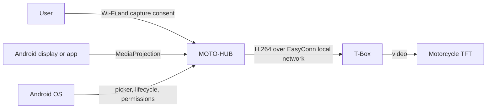
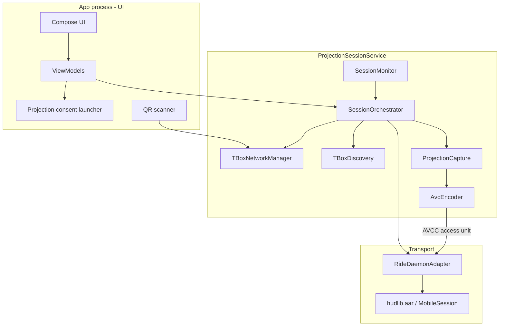
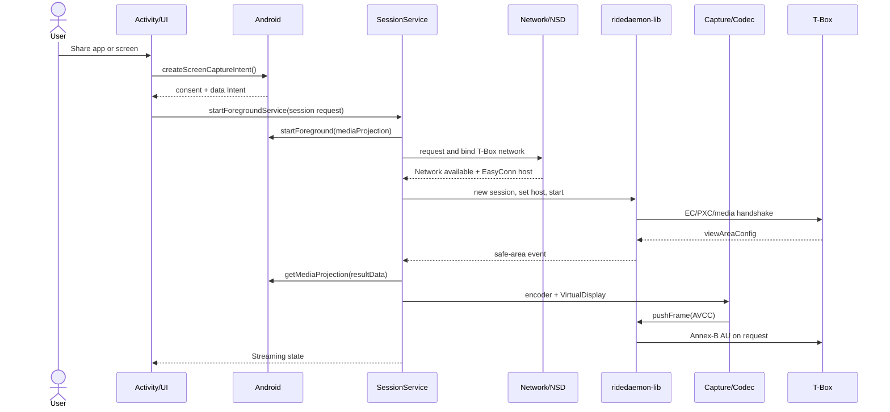
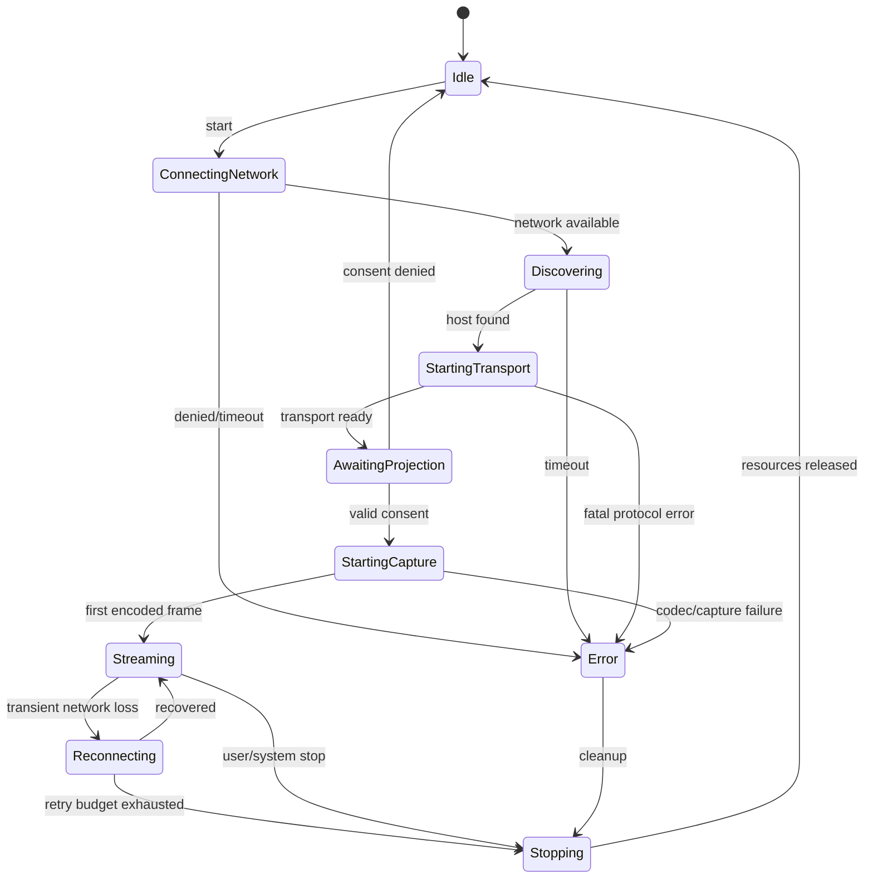

# Architecture

Status: initial proposal

## Summary

The recommended architecture is a native Kotlin/Compose Android app with a
foreground service owning the session. `ridedaemon-lib` remains an isolated
transport module: it receives already encoded H.264 frames and handles
discovery, handshake, control channels and delivery to the T-Box.

The video source is Android `MediaProjection`. In the MVP, projection writes
directly to the `MediaCodec` input `Surface`; a later EGL pipeline can add
scaling, crop, rotation and overlays without changing the transport.

## Context



The motorcycle BLE interface does not appear in the flow: it is a separate
interface for events and commands and is not required to transport navigation
frames.

## Components



### Responsibilities

| Component | Responsibility | Must not do |
|---|---|---|
| Compose UI | onboarding, consent, state, stop | own codecs or sockets |
| `ProjectionSessionService` | session survival and notification | contain Go protocol logic |
| `SessionOrchestrator` | state machine and start/stop order | use UI callbacks as global state |
| `TBoxNetworkManager` | network request, callbacks, binding and release | assume Wi-Fi has Internet |
| `TBoxDiscovery` | NSD `_EasyConn._tcp.` and TXT validation | maintain a video session |
| `ProjectionCapture` | token, callback and `VirtualDisplay` | encode or transmit frames |
| `AvcEncoder` | configure/drain `MediaCodec` | accumulate unbounded frames |
| `RideDaemonAdapter` | adapt AAR callbacks and lifecycle | know about Activity or Compose |
| `SessionMonitor` | local metrics, timeout and health | send remote telemetry in MVP |

## Data Boundaries

- T-Box credentials: UI/onboarding -> protected storage -> network manager.
- `MediaProjection` token: Activity -> service, current session only; not
  persisted or reused.
- Video frames: `MediaCodec` output -> `RideDaemonAdapter` -> Go memory ->
  network. No disk writes.
- T-Box events: Go callback -> adapter -> orchestrator -> UI-observable state.
- Logs: structured events and metrics; never frames, passwords, tokens or full
  QR payloads.

## Startup Flow



The exact order between T-Box session and codec creation can be optimized, but
the codec must not produce indefinitely before transport is ready. The safe
area received from the T-Box determines the effective resolution; if no event
arrives before timeout, use the verified `800x400` profile or fail according to
hardware tests.

## State Machine



Rules:

- Only one active `start` command and one session per process.
- Every transition has a timeout.
- `stop` is idempotent and valid from any non-`Idle` state.
- Fatal `MobileSession` errors move to `Stopping`.
- `MediaProjection.onStop()` does not reuse the token: it ends the session and
  requires new consent to restart.
- Automatic reconnection cannot recreate a terminated projection.

## Network Strategy

The T-Box is a local network, often without Internet access. The source app may
still depend on Internet for maps and live data.

Proposed strategy:

1. Register a WPA2 `WifiNetworkSuggestion` with the QR SSID and password.
2. Observe active Wi-Fi networks with `ConnectivityManager`.
3. Start Go discovery and transport only when `LinkProperties` contains a
   `192.168.0.x` address; this is the same strategy as the reference app.
4. Let Android use the T-Box as the primary Wi-Fi network for the session.

`WifiNetworkSpecifier` and per-socket local-network binding are not the MVP
path: on some OEMs the network is assigned but `Network.bindSocket()` returns
`EPERM`. The operational fallback is primary T-Box Wi-Fi with mobile data for
apps that need Internet.

## Video Pipeline

### MVP: Direct Surface

```text
MediaProjection -> VirtualDisplay -> MediaCodec input Surface
                -> encoder output AVCC -> MobileSession.pushFrame()
                -> Annex-B/AUD conversion -> T-Box
```

Advantages: fewer copies, lower latency and contained implementation. Limits:
reduced control over aspect ratio, rotation, background and overlays.

### Evolution: EGL Compositor

```text
MediaProjection -> SurfaceTexture -> OpenGL/EGL compositor
                -> MediaCodec input Surface -> transport
```

Introduce it only if tests demonstrate that direct scaling is insufficient. It
allows fit/fill, custom bars, rotation, privacy masks and diagnostic overlays,
but increases power use and the risk of irregular frame pacing.

## Concurrency and Backpressure

- Main thread: UI and short Android callbacks only.
- Service scope: serialized state-machine orchestration.
- Codec drain: dedicated thread at moderately high priority.
- Go callbacks: immediately converted to internal events; no direct Compose
  access.
- Transport must prefer the newest frame. Do not introduce a
  `Channel.UNLIMITED` between encoder and library.
- Measure `pushFrame()`: if it blocks, insert a bounded capacity-1 buffer with a
  drop-oldest strategy.

## Error Handling

| Class | Example | Behavior |
|---|---|---|
| User | consent denied | return to `Idle`, no retry |
| Transient network | AP lost | short retry with budget, then stop |
| Discovery | no service | limited retry and diagnostics |
| Fatal protocol | handshake rejected | complete cleanup, no loop |
| Projection | `onStop()` | definitive stop and new consent |
| Codec | encoder unavailable | known-profile fallback, otherwise error |
| Thermal | severe throttling | future fps/bitrate reduction or visible stop |

## Proposed Repository Structure

```text
app/
  src/main/java/.../
    app/                 Application, MainActivity, navigation
    feature/onboarding/  QR and T-Box configuration
    feature/home/        session state and actions
    feature/settings/    quality, diagnostics, privacy
    session/             service, orchestrator, state machine
    capture/             MediaProjection and VirtualDisplay
    encoding/            MediaCodec AVC
    tbox/                network, discovery, ridedaemon adapter
    diagnostics/         local logs and metrics
core/model/              shared immutable models
libs/hudlib.aar          generated artifact, if not automated
documentation/           project documents
external upstream repositories                    consulted upstream, not included in the build
```

For the MVP, a single Gradle `app` module with well-separated internal
packages is sufficient. Extracting Gradle modules before real tests and
dependencies exist would add cost without concrete isolation.

## Local Observability

Minimum per-session metrics:

- network, discovery, handshake and first-frame timings;
- resolution, requested fps, bitrate and selected codec;
- encoded frames, dropped frames and `pushFrame` errors;
- normalized stop reason;
- network changes, projection callbacks and thermal level.

The exported log must replace SSID, IP, MAC, serial and QR values with hashes or
placeholders.

## Deferred Decisions

- Need for an EGL compositor.
- Exact reconnection policy.
- Whether to expose 15/20/30 fps profiles to users.
- BLE support.
- Per-socket network binding inside `ridedaemon-lib`.
- Officially supported models and firmware.
