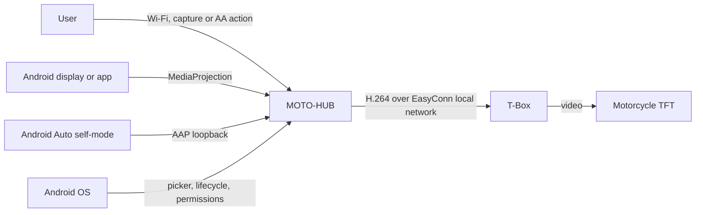
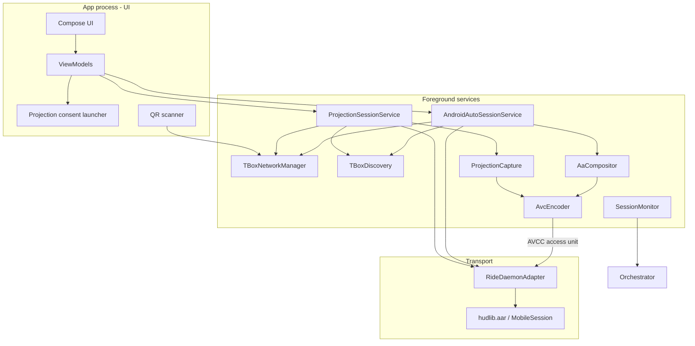
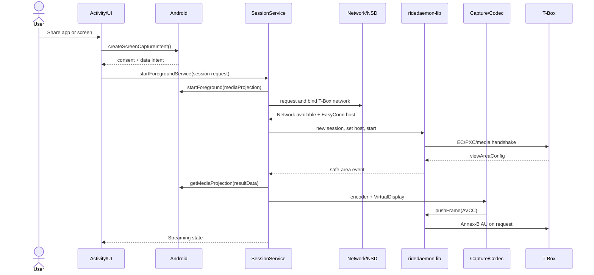
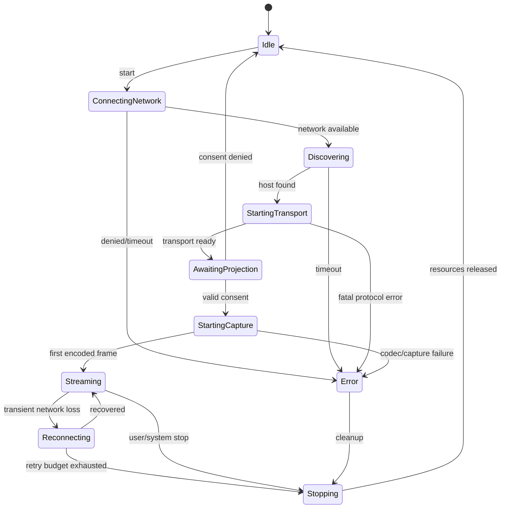

# Architecture

Status: active architecture

## Summary

MOTO-HUB is a native Kotlin/Compose Android app with foreground services owning
projection sessions. `ridedaemon-lib` remains an isolated
transport module: it receives already encoded H.264 frames and handles
discovery, handshake, control channels and delivery to the T-Box.

There are two separate projection modes:

- screen/app mirroring through Android `MediaProjection`;
- full Android Auto through a local AAP receiver and GPU compositor.

## Context



The motorcycle BLE interface does not appear in the flow: it is a separate
interface for events and commands and is not required to transport navigation
frames.

## Components



### Responsibilities

| Component | Responsibility | Must not do |
|---|---|---|
| Compose UI | onboarding, consent, state, stop | own codecs or sockets |
| `ProjectionSessionService` | session survival and notification | contain Go protocol logic |
| `SessionOrchestrator` | state machine and start/stop order | use UI callbacks as global state |
| `TBoxNetworkManager` | network request, callbacks, binding and release | assume Wi-Fi has Internet |
| `TBoxDiscovery` | NSD `_EasyConn._tcp.` and TXT validation | maintain a video session |
| `ProjectionCapture` | token, callback and `VirtualDisplay` | encode or transmit frames |
| `AvcEncoder` | configure/drain `MediaCodec` | accumulate unbounded frames |
| `RideDaemonAdapter` | adapt AAR callbacks and lifecycle | know about Activity or Compose |
| `SessionMonitor` | local metrics, timeout and health | send remote telemetry |

## Data Boundaries

- T-Box credentials: UI/onboarding -> protected storage -> network manager.
- `MediaProjection` token: Activity -> service, current session only; not
  persisted or reused.
- Video frames: `MediaCodec` output -> `RideDaemonAdapter` -> Go memory ->
  network. No disk writes.
- T-Box events: Go callback -> adapter -> orchestrator -> UI-observable state.
- Logs: structured events and metrics; never frames, passwords, tokens or full
  QR payloads.

## Startup Flow



The codec must not produce indefinitely before transport is ready. The event
collector is installed before the T-Box handshake so an immediate area message
cannot be lost. The runtime area determines the effective resolution and is
aligned to H.264 macroblocks. If the live event times out, only a geometry saved
for the same T-Box SSID may be used; otherwise startup fails explicitly. There
is no model-specific or global resolution fallback.

## State Machine



Rules:

- Only one active `start` command and one session per process.
- Every transition has a timeout.
- `stop` is idempotent and valid from any non-`Idle` state.
- Fatal `MobileSession` errors move to `Stopping`.
- `MediaProjection.onStop()` does not reuse the token: it ends the session and
  requires new consent to restart.
- Automatic reconnection cannot recreate a terminated projection.

## Network Strategy

The T-Box is a local network, often without Internet access. The source app may
still depend on Internet for maps and live data.

Implemented strategy:

1. Request the QR-provided WPA2 SSID and password with `WifiNetworkSpecifier`.
2. Accept the Android `Network` only after its `LinkProperties` contain a usable
   IPv4 address; do not assume a fixed T-Box DHCP subnet.
3. Bind the process while EasyConn opens its reverse sockets and run Android
   NSD explicitly on the requested network.
4. Validate the `_EasyConn._tcp` service metadata before configuring RideDaemon.
5. Release the process-wide binding when possible while keeping the requested
   T-Box network alive for network-bound sockets.

Some OEMs or active VPNs can reject process or socket binding. Those failures
must remain explicit diagnostics rather than being treated as a subnet mismatch.

## Video Pipeline

### Mirroring: Direct Surface

```text
MediaProjection -> VirtualDisplay -> MediaCodec input Surface
                -> encoder output AVCC -> MobileSession.pushFrame()
                -> Annex-B/AUD conversion -> T-Box
```

Advantages: fewer copies, lower latency and contained implementation. Limits:
reduced control over aspect ratio, rotation, background and overlays.

### Android Auto: EGL Compositor

```text
MediaProjection -> SurfaceTexture -> OpenGL/EGL compositor
                -> MediaCodec input Surface -> transport
```

Android Auto uses a GPU compositor to place the decoded AAP video on the T-Box
canvas. It applies `FIT`, `STRETCH`, and `CROP`, safe margins, phone-preview
output, touch mapping and encoder-surface recovery.

## Concurrency and Backpressure

- Main thread: UI and short Android callbacks only.
- Service scope: serialized state-machine orchestration.
- Codec drain: dedicated thread at moderately high priority.
- Go callbacks: immediately converted to internal events; no direct Compose
  access.
- Transport must prefer the newest frame. Do not introduce a
  `Channel.UNLIMITED` between encoder and library.
- Measure `pushFrame()`: if it blocks, insert a bounded capacity-1 buffer with a
  drop-oldest strategy.

## Error Handling

| Class | Example | Behavior |
|---|---|---|
| User | consent denied | return to `Idle`, no retry |
| Transient network | AP lost | short retry with budget, then stop |
| Discovery | no service | limited retry and diagnostics |
| Fatal protocol | handshake rejected | complete cleanup, no loop |
| Projection | `onStop()` | definitive stop and new consent |
| Codec | encoder unavailable | known-profile fallback, otherwise error |
| Thermal | severe throttling | adaptive fps/bitrate reduction or visible stop |

### Reconnection Budgets

Two independent retry budgets exist, both identical across both
projection modes (mirroring, Android Auto):

- **Initial EasyConn connect** (`EasyConnRetry.kt`, `EasyConnRetryPolicy`):
  3 attempts, exponential backoff `750ms -> 1500ms` (capped at `2000ms`),
  only for failures classified as transient (timeout, connection
  refused/reset, transport-level I/O errors). Runs once, before the
  RideDaemon session exists.
- **Mid-session stream recovery** (`RECOVERY_RETRY_MILLIS` /
  `RECOVERY_GIVE_UP_MILLIS`, defined identically in
  `ProjectionSessionService` and `AndroidAutoSessionService`): retries every
  `5s`, gives up after `120s` total with no successful reconnect - this is
  the concrete budget behind the `Reconnecting -> Stopping: retry budget
  exhausted` transition above. Unified 2026-07-20; before that, mirroring
  had no recovery at all and Android Auto was single-attempt-only.

## Proposed Repository Structure

```text
app/
  src/main/java/.../
    app/                 Application, MainActivity, navigation
    feature/onboarding/  QR and T-Box configuration
    feature/home/        session state and actions
    feature/settings/    quality, diagnostics, privacy
    session/             service, orchestrator, state machine
    capture/             MediaProjection and VirtualDisplay
    encoding/            MediaCodec AVC
    tbox/                network, discovery, ridedaemon adapter
    diagnostics/         local logs and metrics
core/model/              shared immutable models
libs/hudlib.aar          generated artifact, if not automated
documentation/           project documents
external upstream repositories                    consulted upstream, not included in the build
```

The current Android app remains a single Gradle `app` module with separated
internal packages. Extract Gradle modules only when tests or ownership
boundaries justify the cost.

## Local Observability

Minimum per-session metrics:

- network, discovery, handshake and first-frame timings;
- resolution, requested fps, bitrate and selected codec;
- encoded frames, dropped frames and `pushFrame` errors;
- normalized stop reason;
- network changes, projection callbacks and thermal level.

The exported log must replace IP and MAC values with placeholders
(`ProjectionEventLog.redact()` does this with pattern matching, independent of call site,
covered by `ProjectionEventLogRedactionTest`). Full QR payloads and passwords must never be
logged in the first place rather than redacted after the fact - verify any new QR/credential
handling code logs only derived, non-secret fields. T-Box Wi-Fi SSIDs are deliberately left
unredacted: they are short manufacturer-assigned identifiers (e.g. `CFMOTO-XXXX`), not
personally revealing, and are needed in context throughout diagnostics and support logs; a
generic pattern cannot reliably distinguish them from other free text without restructuring
every call site. There is currently no serial/HUID field collected from the T-Box at all, so
none appears in logs to redact.

## Deferred Decisions

- Need for an EGL compositor.
- Exact reconnection policy.
- Whether to expose 15/20/30 fps profiles to users.
- BLE support.
- Per-socket network binding inside `ridedaemon-lib`.
- Officially supported models and firmware.
