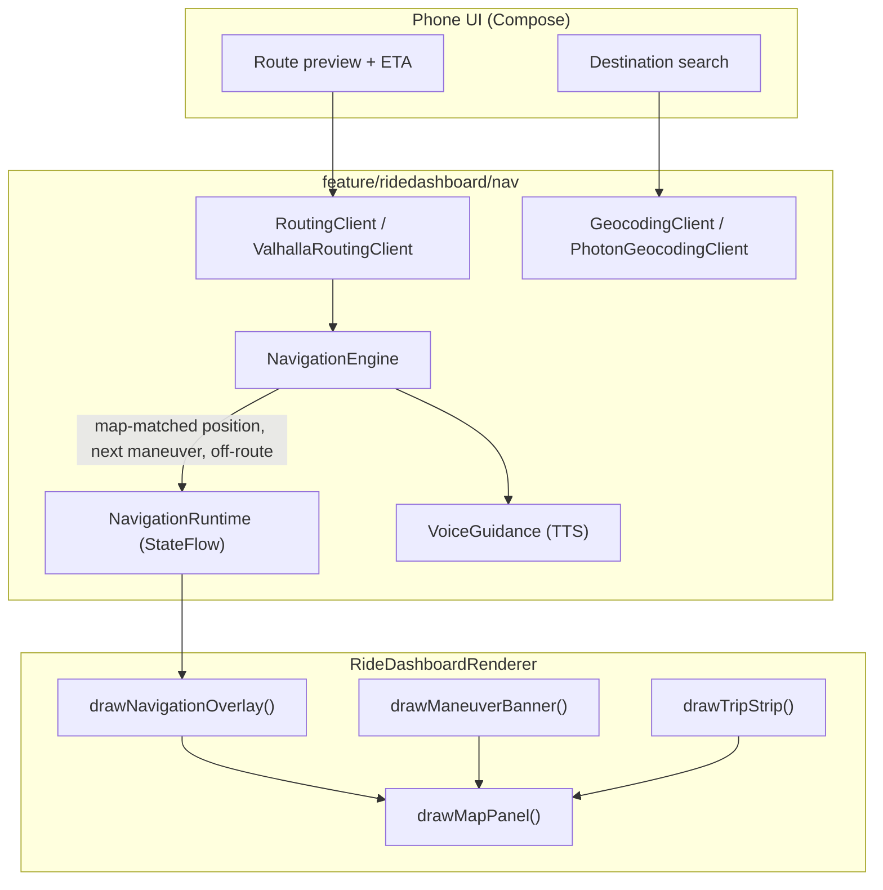

# Native Ride Dashboard Navigation

Status: M0 (spike), M1 (guidance) and M2 (destination UX, including the M2b
motorcycle-specific tranche) implemented; M3 (premium polish) next - see
[NAVIGATION_M2_REQUIREMENTS.md](NAVIGATION_M2_REQUIREMENTS.md) for the M2a/M2b
split and the M3 feasibility note below before committing to lane guidance or
speed-limit warning.

## Summary

MOTO-HUB adds turn-by-turn navigation natively inside Ride Dashboard, rendered
into the same `Canvas` pipeline that already draws the OpenStreetMap region,
the live track and telemetry. No Google Maps, no WebView, no embedded
third-party navigation UI: routing and geocoding are online services consumed
as data (JSON in, drawing instructions out), and every pixel on the TFT is
still produced by `RideDashboardRenderer`.

This keeps the three projection modes intact (mirroring, full Android Auto,
Ride Dashboard) and treats navigation as a new data source for the existing
map panel, not a new rendering path.

## Why Not Google Maps

Explored and rejected:

- **WebView + Maps JavaScript API**: Google's terms and runtime behavior
  actively prevent turn-by-turn usage inside a WebView; already verified
  non-viable.
- **Maps SDK for Android**: view-only, no turn-by-turn, no supported way to
  redirect its GL rendering into an offscreen `Surface`/`Bitmap`. `snapshot()`
  exists but is not meant for continuous per-frame capture.
- **Navigation SDK for Android**: the only Google product with real
  turn-by-turn, but it is a gated commercial product (Maps Platform
  agreement, billing), renders into its own `NavigationView`, and its terms do
  not cover re-projecting onto a non-certified vehicle display.

Google Maps navigation remains available today through the existing Android
Auto embedded receiver (`EmbeddedAndroidAutoSource`) — that path is legitimate
and already implemented. This document is about a second, independent
capability: a fully native navigator that is part of Ride Dashboard itself,
works offline-ready by construction, and is not subject to any of the above
constraints.

## Stack

| Concern | Choice | Reason |
|---|---|---|
| Routing | **Valhalla** (Stadia Maps hosted) | `motorcycle` costing profile, turn-by-turn maneuvers, roundabout exit numbers, Meili map-matching. OSM-sourced, same engine can run on-device later for offline. |
| Geocoding / search | **Photon** (Komoot, OSM data) | Built for autocomplete-as-you-type; Nominatim as fallback. |
| Voice guidance | Android `TextToSpeech` | Native, routes over the phone's Bluetooth link including helmet intercoms. |
| Map rendering (initial) | Existing Canvas/tile pipeline | Zero new rendering risk; route line, maneuver arrows and puck added as overlay draws. |
| Map rendering (later) | MapLibre Native, offscreen → Bitmap | Vector map, heading-up 3D perspective; also the natural path to offline maps. |
| Data models | kotlinx.serialization | Add to the version catalog; `org.json` is the zero-dependency fallback. |

Mapbox Directions was considered for its richer banner/voice instruction
payload (SSML, lane guidance, shields) but rejected: its terms push toward
using the Mapbox basemap, which conflicts with staying OSM-clean and
offline-ready.

## Architecture

`NavigationRuntime` follows the same object+`StateFlow` pattern already used
by `TripRecordingRuntime` and `RideDashboardTrackOverlayRuntime`: the render
thread reads an immutable snapshot at zero synchronization cost, the engine
runs on a background scope.

### New components

- **Models**: `NavRoute` (polyline + legs), `NavManeuver` (type, modifier,
  position, instruction text, verbal instruction, distance), `NavProgress`.
- **`RoutingClient`** (interface) + **`ValhallaRoutingClient`**: HTTP bound to
  the cellular network, reusing the network-binding pattern already
  implemented in `OpenStreetMapTileProvider` (the T-Box Wi-Fi network has no
  Internet).
- **`GeocodingClient`** + **`PhotonGeocodingClient`** (Photon has no key
  requirement).
- **`NavigationSettingsStore`**: encrypts the rider's own Stadia Maps API key
  with Android Keystore, the same way `MotorcycleProfileStore` encrypts the
  T-Box Wi-Fi password. There is no bundled or shared key and no build-time
  secret: every installation authenticates with the key the rider enters in
  Settings > Navigation.
- **`NavigationEngine`**: map-matching, distance-to-maneuver, off-route
  detection, reroute. Publishes `NavigationState`.
- **`NavigationRuntime`**: `StateFlow<NavigationState?>` observed by the
  renderer.
- **`VoiceGuidance`**: TTS wrapper with distance-threshold scheduling scaled
  by current speed.
- **Renderer additions**: `drawNavigationOverlay()` called from inside the
  existing `drawMapPanel()`, plus `drawManeuverBanner()` and
  `drawTripStrip()`.
- **Phone UI** (`feature/navigation/`): search → results → route preview/ETA
  → confirm → active-navigation controls (stop, mute). One function per
  screen, drill-down, no dense views — consistent with the rest of the app.

## UX

**Phone** (destination entry only; locked above ~5 km/h, set while stationary):
search → pick result → preview route + ETA → start. Recents/saved
destinations, and "navigate here" from a long-press on the map.

**TFT** (glanceable, lime accent, consistent with current app theme):

- Maneuver banner at the top: arrow derived from maneuver type + modifier,
  distance, street name.
- Next-next chip ("then turn left").
- Heading-up map with the bike anchored low and a look-ahead camera.
- Trip strip at the bottom: ETA, remaining distance, arrival time.
- Lane guidance and speed-limit warning when the provider supplies them.
- Off-route / recalculating indicator.

## Milestones

- **M0 — Spike**: `ValhallaRoutingClient` + models, phone-to-destination
  route request, static polyline drawn on the dashboard, cellular-bound
  networking. Proves the pipeline end to end.
- **M1 — Guidance**: `NavigationEngine` (map-matching, progress, next
  maneuver, off-route + reroute), `NavigationRuntime`, maneuver banner + trip
  strip + baseline TTS.
- **M2 — Destination UX (phone)**: Photon search, recents/saved, route
  preview (with an embedded OSM route map) + confirm, start/stop, stationary
  lock. **M2b (motorcycle-specific, implemented 2026-07-19)**: scenic bias,
  weather-at-arrival, fuel range warning, golden-hour hint, curvy-road
  highlighting (preview + TFT overlay), GPX export, ride-again (saved
  routes). See [NAVIGATION_M2_REQUIREMENTS.md](NAVIGATION_M2_REQUIREMENTS.md).
- **M3 — Premium polish**: heading-up rotation + look-ahead camera,
  speed-adaptive zoom, refined maneuver iconography, intercom voice routing,
  handlebar mute gesture. **Lane guidance and speed-limit warning are cut
  from M3** - see "M3 feasibility: Valhalla/Stadia data gaps" below; they
  need a different data source and are their own milestone if pursued.
- **M4 — Strategic "wow"**: MapLibre Native rendered offscreen into a
  `Bitmap`, vector map with heading-up 3D perspective; the natural path to
  offline maps.

## M3 Feasibility: Valhalla/Stadia Data Gaps

Checked 2026-07-19 against the live Stadia Maps-hosted Valhalla `/route`
endpoint (three test routes: Milan motorcycle costing, Milan auto costing,
downtown Seattle auto costing - chosen for OSM turn-lane tagging density) and
the [valhalla-docs](https://github.com/valhalla/valhalla-docs) source, not
just AI-summarized doc pages (one earlier summary fabricated a `turn_lanes`
parameter and an "exact quote" that does not exist in the actual docs -
verify against `raw.githubusercontent.com` source, not just a page-fetch
summary, before trusting API capability claims):

- **Lane guidance: not available, at any Stadia plan.** The turn-by-turn
  `/route` API has no `turn_lanes` request parameter and maneuvers never
  contain a `lanes` field - confirmed both by grepping the actual
  `turn-by-turn/api-reference.md` source and by three live test requests
  (with and without a fabricated `turn_lanes` flag) that all returned
  maneuvers without a `lanes` key. The only place lane data exists in
  Valhalla at all is `map-matching`'s `trace_attributes` response
  (`edge.lane_count`, a bare count, not turn-arrow indications), which
  operates on a recorded GPS trace, not a planned route - a different use
  case entirely (post-hoc trip analysis, not live guidance).
- **Speed-limit warning: not available, at any Stadia plan.** The `/route`
  maneuver response has no `speed_limit` field; Valhalla's `speed`/
  `speed_limit` costing inputs configure the router, they are not returned
  as trip output. Getting a speed limit per road segment would need a
  different data source entirely - e.g. an Overpass/OSM `maxspeed` tag
  lookup keyed to the route polyline, or a commercial provider (HERE,
  TomTom) that includes speed limits in routing responses. This is an
  architecture decision, not a plan upgrade.
- **Everything else in M3 needs no external API**: heading-up rotation,
  look-ahead camera, speed-adaptive zoom, maneuver iconography, intercom
  voice routing and the mute gesture are all local rendering/audio/input
  work, unaffected by Stadia plan tier.
- **Free-plan constraint that matters regardless of M3 scope**: Stadia's
  free tier is 200,000 credits/month (a route request costs 20 credits,
  ~10,000 routes/month) and **explicitly forbids commercial use** - fine for
  personal/dev use, but a blocker the moment MOTO-HUB is distributed beyond
  that, independent of which M3 features are built.

## Risks And Open Questions

- Render-thread cost of route drawing plus rotation at sustained fps
  (mitigated by the immutable-snapshot pattern already in use).
- MapLibre offscreen → `Bitmap` integration (owns an EGL/GL context) is the
  concentrated risk of M4.
- Provider terms, limits and reroute latency over cellular; voice timing at
  higher speeds.
- Accent color: confirmed lime (`#C9F53A`), matching the current app theme
  rather than the newer teal explored for the launcher icon.
- JSON dependency: kotlinx.serialization chosen over zero-dependency
  `org.json`.

## Related

- [Architecture](ARCHITECTURE.md)
- [Ride Dashboard](RIDE_DASHBOARD.md)
- [Roadmap](ROADMAP.md)
- [ADR-005](decisions/ADR-005-native-navigation-over-google-maps.md)
