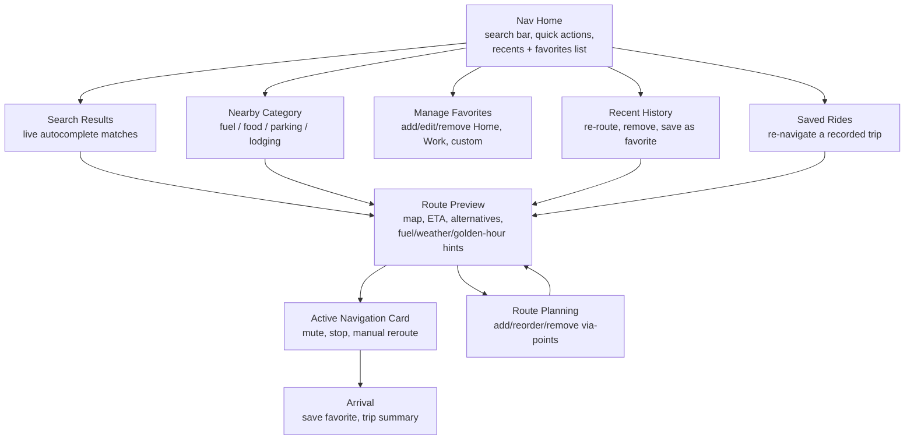

# M2 - Phone Navigation UX Requirements

Status: M2a and M2b both implemented (2026-07-19). See [NAVIGATION.md](NAVIGATION.md) for the current milestone status and the M3 feasibility note.
Depends on: [NAVIGATION.md](NAVIGATION.md) (M0/M1, implemented), [ADR-005](decisions/ADR-005-native-navigation-over-google-maps.md)

## Summary

M0/M1 built the navigation pipeline end to end: Valhalla routing, Photon
geocoding, map-matching, maneuver guidance, voice, auto-reroute, all rendered
live on the Ride Dashboard TFT. The phone side is still the M0 spike: one
text field, a flat result list, a route summary card. M2 replaces that with a
real destination-entry experience, at parity with what riders expect from a
dedicated GPS navigator, plus a set of motorcycle-specific features that
generic car navigators don't offer.

Every feature below stays inside the architecture already committed to in
ADR-005: OSM-based data, no Google Maps, cellular-bound networking, no
bundled API keys. New keyless or already-adopted services are called out
explicitly; anything needing a new paid or keyed service is flagged for a
decision before implementation.

## Goals

- Destination entry that feels like a real GPS unit: autocomplete, recents,
  favorites, category search, route preview before committing.
- Motorcycle-specific differentiators no car-first navigator offers:
  scenic/twisty routing bias, weather-at-arrival, fuel-range awareness,
  golden-hour warning, GPX export/import, and reusing MOTO-HUB's own
  recorded trips as navigable routes.
- Stay one-function-per-screen, drill-down, no dense views - consistent with
  the rest of the app.
- Big-target, glove-friendly touch UI: destination entry happens stationary,
  often with gloves half-on.

## Non-Goals (this milestone)

- Anything rendered differently on the TFT (M1 already owns maneuver
  banner/strip/voice; M2 is phone-only).
- True curvature-based scenic routing (would need a custom routing backend).
  M2 approximates "twisty/fun" via highway-avoidance costing, which is
  honestly a proxy, not a curvature model.
- Turn-by-turn on the phone screen itself while riding (the TFT is the
  riding display; the phone screen is for stationary destination entry and
  a glanceable status card).

## Feature Set

### Core - GPS navigator table stakes

| Feature | Notes |
|---|---|
| Autocomplete-as-you-type | Debounced Photon queries replacing the M0 explicit search button. |
| Recent destinations | Local history, most-recent first, tap to re-route, swipe to remove or save as favorite. |
| Favorites (Home/Work/custom) | Named, pinned places; one-tap "take me home" from Nav Home. |
| Category/nearby search | "Fuel", "food", "parking", "lodging" near current position, not just exact addresses. |
| Route preview before starting | Map thumbnail, distance, ETA, arrival clock time, before committing to guidance. |
| Route alternatives | Fastest vs avoid-highways ("scenic"), using Valhalla costing knobs already available on the free tier. |
| Multi-waypoint routing | Add/reorder/remove via-points for touring days with multiple stops. |
| Search by coordinates | Paste `lat,lon` directly for trailheads/meeting points with no address. |
| Voice mute/volume control | Surfaced in the nav UI, not buried in Settings only. |
| Manual recalculate | User-triggered reroute, independent of the automatic off-route trigger. |
| Stop/cancel navigation | With confirmation once a route is active. |
| Arrival screen | "You have arrived", offer to save as favorite if new, trip summary if recording was active. |
| Units preference | km/mi, follows the same settings pattern as existing video/quality prefs. |
| Clear state messaging | Distinct, non-confusing states for "no API key set", "no cellular network", "rate-limited" - never one generic error string. |

### Motorcycle-specific - creative differentiators

| Feature | Notes | Feasibility |
|---|---|---|
| Scenic/twisty route bias | Valhalla `motorcycle` costing exposes `use_highways`/`shortest` weights; biasing away from highways routes through B-roads as a practical proxy for "fun road." | Ready - same Valhalla call, different costing params. |
| Weather-at-arrival banner | "Rain likely at your ETA" using position + route ETA. | **Open-Meteo** - free, keyless, no account needed. New client, same shape as `GeocodingClient`. |
| Fuel-range awareness | Enter (or reuse from Garage) the bike's tank range; warn if the route exceeds it, suggest a fuel stop. | Uses existing per-motorcycle Garage profile as the natural home for tank range. |
| Golden-hour/sunset warning | "You'll arrive after sunset" from sun-position math against ETA and route location. | Pure astronomy calculation, no external service. |
| Curvy-road highlighting | Color the route line by turn density so a "fun section" is visible on the map at a glance. | Derivable from the existing polyline/bearing-change data already decoded from Valhalla's shape. |
| Elevation profile preview | Simple elevation graph before starting, useful for mountain routes. | **Needs a feasibility/tier check** - Valhalla elevation sampling may be a separate service; verify before committing. |
| GPX export of a *planned* route | Share the calculated route with riding buddies, or load it on another device. | Trivial - reuses the existing `GpxExporter` used by Trip Recording, generalized to accept a `NavRoute`. |
| "Ride again" from recorded trips | Turn a past GPS-recorded ride (Trip Library) into a navigable route to repeat it. | Natural cross-feature tie: Trip Recording already has the exact path; feed it to the same route-drawing/guidance pipeline instead of Valhalla. |
| Auto-mute without a paired audio route | Don't blast phone speaker at speed if no Bluetooth headset/intercom is connected. | `AudioManager` Bluetooth SCO/A2DP state check. |

## Screen Inventory

One function per screen, drill-down, matching the rest of the app:

## Data And Settings Additions

- **`NavigationHistoryStore`**: recent destinations (label, point, timestamp), same lightweight local-storage pattern as `TripStore`. Not sensitive - no encryption needed.
- **`NavigationFavoritesStore`**: named favorites (Home/Work/custom).
- **`WeatherClient`** (Open-Meteo): keyless, mirrors the shape of `GeocodingClient`.
- **`RoutingClient`/Valhalla request extensions**: `alternates`, highway-avoidance costing, multi-location waypoints.
- **`GpxExporter`**: generalize to accept a `NavRoute` in addition to a recorded `TripDetails`.
- **Settings additions**: distance units, default voice on/off, default route preference (fastest/scenic).
- **Garage profile addition**: optional tank range field, feeding fuel-range warnings.

## Decisions (resolved 2026-07-19)

1. **Elevation profile: deferred.** Out of this milestone; revisit after a
   feasibility/tier check on Valhalla elevation sampling.
2. **Fuel range: stored per motorcycle in Garage.** Reuses the existing
   `MotorcycleProfile` data model; feeds the M2b fuel-range warning.
3. **Phasing: split into M2a then M2b.**
   - **M2a (core table-stakes):** autocomplete-as-you-type, recents,
     favorites (Home/Work/custom), route preview with ETA/arrival clock,
     route alternatives (fastest vs scenic/avoid-highways), coordinate
     search, voice mute in-UI, manual recalculate, stop with confirmation,
     arrival screen, units preference, clear state messaging.
   - **M2a deferred to a second tranche:** category/nearby POI search and
     multi-waypoint routing (both need extra services/complexity - Overpass
     or a POI source for categories; waypoint reorder UI for multi-stop).
   - **M2b (motorcycle-specific):** scenic bias, weather-at-arrival, fuel
     range, golden-hour, curvy highlighting, GPX export, ride-again.
4. **Weather/golden-hour: on by default, disable-able in Settings.** (M2b.)

## Related

- [NAVIGATION.md](NAVIGATION.md)
- [ADR-005](decisions/ADR-005-native-navigation-over-google-maps.md)
- [TRIP_RECORDING.md](TRIP_RECORDING.md) (GPX export precedent, "ride again" source data)
